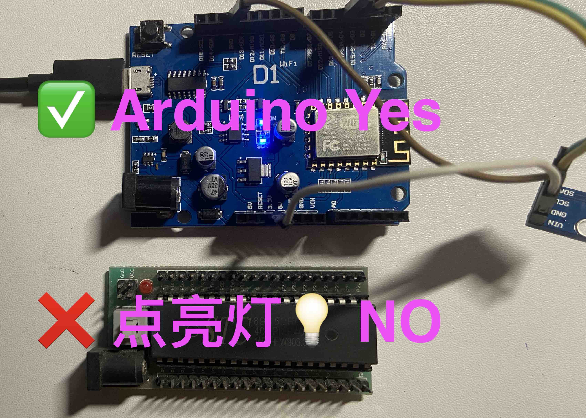

# Arduino_FromHelloworld2ByeBye
早些年就玩过C51的单片机 但是一直都没有玩明白 也就点亮了几个灯泡 但是心里面一直有这个种子 这些年学的一直是软件/框架 很少能接触硬件 （最近的一次接触硬件应该是计算机组成原理的实验课上，那个箱子我到现在也没明白是干啥的） 但最近了解到了Arduino这个平台 可以使用更人性化一些的编程语言编写程序 丰富驱动封装和Example 所以想再入一次这个坑 看能不看多点亮两个灯泡 💡  点亮灯泡过程中的笔记 和 Demo 放到这个 Repository 中 一是方便整理回顾 二是在从入门到放弃的路上不再孤单 

